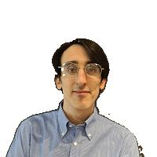

# GCN for backgruond detection

In this repository we are implementing a simple model leveraging Graph Neural Networks, in particular Graph Convolutional Networks, to detect the background of an image given only a small subset of pixels as ground truth.

The peculiarity of this model is that it doesn't make use of any pretrained network or large dataset. We train everything directly on the image of which we want the background removed together with a small subset of pixels manually labeled (an operation requiring no more than some seconds). The model is small, fast, and still discretely effective. Of course, it doesn't compare to bigger models, but it serves as proof of concept of an idea that could be further explored.

## Explanation

In this model, the image is not processed as a 3D tensor (width, height, channels) as it usually is in Computer Vision (especially in CNNs). Instead, we use the pixel graph of the image. This graph is composed of a node for every pixel and arcs connecting any two adjacent pixels (not diagonally). This choice makes the whole process a lot focused on the individual pixels, rather than the whole image, with the possibility to output a value for every pixel indicating whether or not it belongs to the background or not. The task can be considered a simple form of image segmentation.

The model is a simple Graph Convolutional Network or GCN for short. They are presented and explained in this [paper](https://arxiv.org/abs/1609.02907). A CNN can be seen as a form of GCN. While CNNs only work on images, GCNs work on every type of graph data.

Some advantages of using GCNs for images can be:
1. The model is not only invariant to translations but also to reflection. In standard models, we can achieve reflection invariance via data augmentation. Here the model is intrinsically able to leverage this kind of symmetry;
2. The model is agnostic of the input size. Many CNNs only work on specific input sizes, while GCNs are trained to only work by considering local neighbors relations and thus can work on any image size. They can even work with more complex, not square shapes, like images with an alpha channel.

Of course, we can also achieve these properties with more complex CV models. But the strength of this model is in its simplicity.

## Results

Here we show the image we started with, the pixels we manually labeled for the training process, and the final result.

